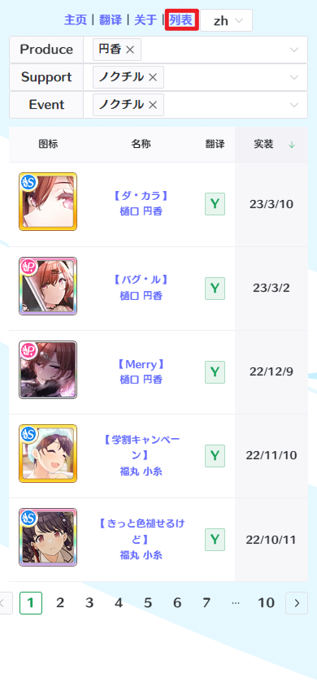

# 翻译入口

本工具提供了多种翻译入口。

- [翻译入口](#翻译入口)
  - [近期游戏更新](#近期游戏更新)
  - [卡片/活动剧情内部导航](#卡片活动剧情内部导航)
  - [卡片/活动索引](#卡片活动索引)
  - [上传本地文件](#上传本地文件)
  - [使用 Github CSV 文件](#使用-github-csv-文件)
    - [直接输入 URL](#直接输入-url)
    - [使用用户脚本导航](#使用用户脚本导航)
    - [切换数据源](#切换数据源)

## 近期游戏更新

网站首页会维护最近游戏更新剧情列表，点击即可进入相应剧情。该列表默认为收起。

## 卡片/活动剧情内部导航

翻译页内部可以切换当前剧情相邻章节。

## 卡片/活动索引

在列表标签页提供了剧情索引，可以筛选出相应剧情并按照实装顺序排列。

## 上传本地文件

翻译标签页中，可以点击“上传文件”来上传从汉化插件获取的空翻译文件（.csv）格式。

## 使用 Github CSV 文件

特殊的，如果你想进行校对工作，或修改当前翻译的部分问题，可能需要修改Github仓库中的文件。

### 直接输入 URL

可以直接在翻译标签页的输入栏输入翻译仓库中CSV文件的地址，网站会载入相应CSV。

例如：`https://github.com/ShinyGroup/SCTranslationData/blob/master/data/story/%E6%AB%BB%E6%9C%A8%E7%9C%9F%E4%B9%83/G.R.A.D.%E7%AF%87/%E3%81%9D%E3%82%8C%E3%81%A7%E3%82%82%E2%80%A6%E2%80%A6.csv`

> 从 Github 复制得到的CSV看起来有乱码，这是正常的，因为URL有特殊的编码规则。

### 使用用户脚本导航

安装[用户脚本](https://static.sc-viewer.top/viewer-button.user.js)，在访问Github的CSV文件时，界面中会额外添加按钮。点击即可导航至翻译页面。

> 需要安装 Tampermonkey/Greasymonkey 等脚本管理扩展。

### 切换数据源

默认情况下，加载的源文件为未翻译状态，如果想切换为Github中已翻译的文件，可以在翻译界面中点击工具栏的“切换数据源”进行切换。

