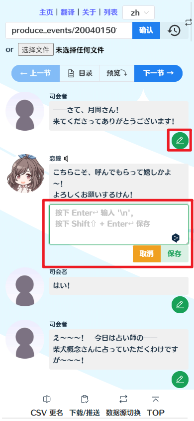
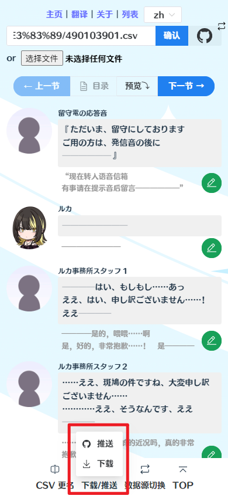
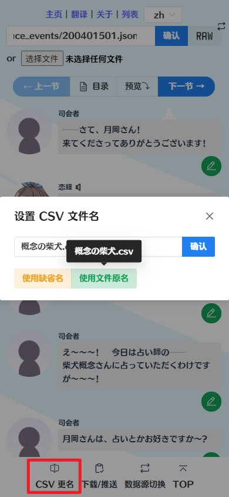
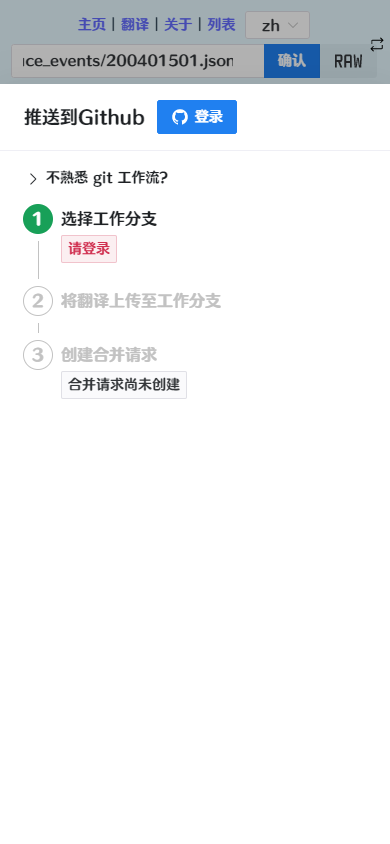
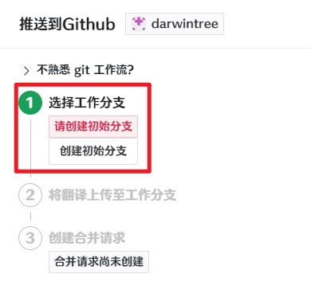
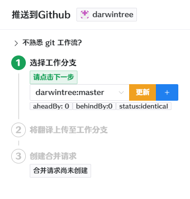
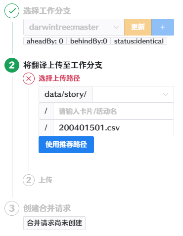
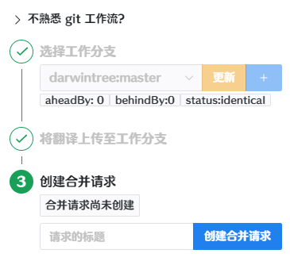
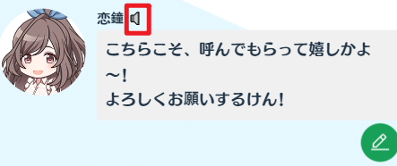
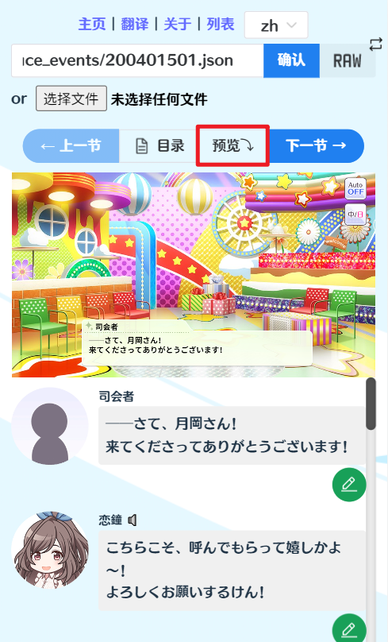

# 进行翻译

- [进行翻译](#进行翻译)
  - [翻译之前](#翻译之前)
  - [翻译](#翻译)
  - [翻译完成](#翻译完成)
    - [下载](#下载)
    - [推送](#推送)
  - [用户友好功能](#用户友好功能)
    - [语音播放](#语音播放)
    - [剧情预览](#剧情预览)

## 翻译之前

- 注意：对于新剧情，尽量在 [角色剧情表](https://docs.qq.com/sheet/DZmxQUkJXWVV3VWpp) 与 [活动剧情表](https://docs.qq.com/sheet/DZkJMa3hqR1VqdEZO) 进行确认，以避免翻译撞车。
- 阅读[翻译格式与规范](https://github.com/ShinyGroup/SCTranslationData/blob/master/%E7%BF%BB%E8%AF%91%E6%A0%BC%E5%BC%8F%E5%92%8C%E8%A7%84%E8%8C%83.md)
- 请先阅读[翻译入口](entrance.md)了解如何选择想要翻译的剧情。

## 翻译

点击每行的编辑按钮后，编辑框将会展开。输入翻译后点击“保存”。翻译文件的当前版本会被保存在浏览器本地。

> 可以在首页查看并管理各个翻译文件的最新保存版本。也可以在点击“切换数据源”后弹出的对话框中选择历史翻译。但注意同一个文件只存在一个历史版本。

## 翻译完成

翻译完成后，可以视你的习惯下载翻译完成的文件，或直接将文件推送至Github。

### 下载

如果需要使用“下载”功能，可以尝试在下载前使用 “CSV 更名”功能修改文件名。

### 推送

推送功能需要登录Github账号，并请求私人仓库的读写权限。

> 当然使用这个功能的前提是有Github账号。

登录后推送分为三步，按照页面指引进行即可。点击“不熟悉git工作流？”，被折叠的内容对工作流的原理进行了简单介绍。

- 创建工作分支：相当于在云端创建了翻译仓库的副本，供你自由地进行编辑，而不会影响他人。
- 将翻译上传至工作分支：将本地的翻译文件上传到云端的工作分支。
- 创建合并请求：告知翻译仓库的管理员你进行了哪些修改，等待管理员决定是否采纳你的修改。

这套工作流可以避免多人同时工作产生的混乱。

具体而言，进行推送需要

1. 创建初始分支/选择工作分支/创建新分支。
    > 推荐在每次推送新内容前更新工作分支或点击“+”创建新分支  
2. 上传内容。上传内容需要选择路径，并提交修改信息。使用推荐内容就好。
    > 修改信息概述本次修改更改了什么，可以直接填写新增/修改了某文件，也可以更随意一些。
3. 创建合并请求。
    > 填一个标题就好，告诉管理员你更改了什么。
   

## 用户友好功能

### 语音播放

点击角色名右侧的🔈可以播放语音。

### 剧情预览

用于在翻译完成后大致预览效果，点击“预览”后可以预览剧情与翻译，可以切换显示语言。

